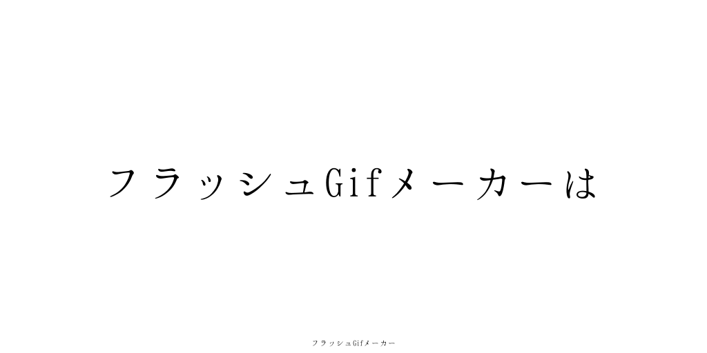

# フラッシュGIFメーカー

## これはなに？

テキストウィンドウに文字を入力するだけで、文字がパッパと切り替わるGIF画像が生成できるウェブアプリです。

↓こんな感じのものが作れます。



稼働先URL　[フラッシュGIFメーカー　https://flashgif.ouvill.net](https://flashgif.ouvill.net)

## 実行に必要なもの

 * docker
 * docker-compose

## 使い方

```
$ echo MYSQL_ROOT_PASSWORD=${dbで使うパスワード} > .env
$ docker-compose build
$ docker-compose up
```

例
```
$ echo MYSQL_ROOT_PASSWORD=password > .env
$ docker-compose build
$ docker-compose up
```

localhost:8080 にサーバーが立ち上がります。

※ `/var/docker/mysql_flash_gif_maker`にコンテナ永続用フォルダが作成されることになっているので、困るときは`docker-compose`の`volumes`を編集してください。

## 画像の追加

 * `public/images/backgrounds/`フォルダに追加したい画像をコピーします
 * `./utils/img_list.js` に追加したい画像の情報を記述します。

 ```
{
    name: "",
    filename: "",
    url: ""
}
 ```

## フォントの追加

 * `fonts` フォルダにフォントを追加します。
 * `views/index.ejs` の190行目付近にフォントに関しての記述があるので、次のHTMLタグを追加します。
 `<option value="${フォント名}">${選択肢で表示したいフォント名}</option>`
 * `docker-compose build` を実行します。
 * コンテナを再起動します
    * `docker-compose stop`
    * `docker-compose rm`
    * `docker-compose up`

## 開発フロー

 gitlab-flow で実行しています。
 product ブランチのみ別リポジトリで非公開設定にしています。

## 一週間で開発した分

　一週間で開発した分が分かりやすいように `one_week` タグをつけました。

## 作者

[Ouvill](https://github.com/Ouvill)

## 製作者のその他制作物

 * [Zen Text Editor](https://zeneditor.ouvill.net) : ブラウザ動作型の縦書きエディタ
 * [類語検索](https://word2vec.ouvill.net)：Word2vec を用いた類語検索
